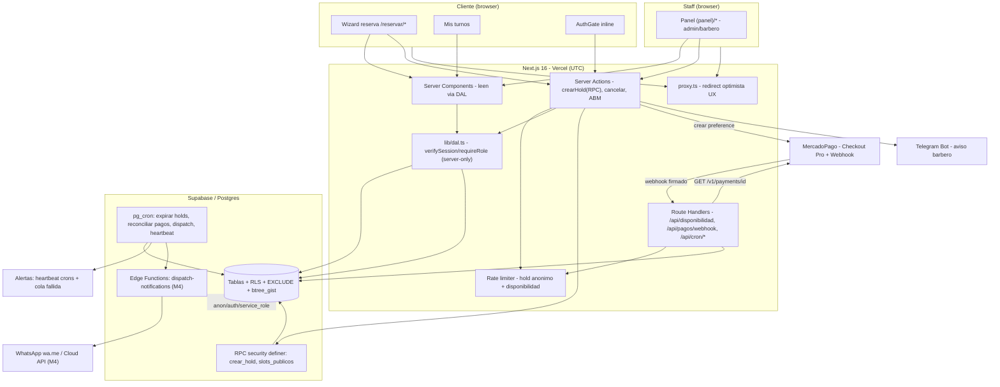

Las afirmaciones del borrador se confirman: greenfield de backend (solo `motion`, `next`, `react` en deps), `data.ts` todo placeholder con precios string y "Barbero 2"/"Barbero 3", "Diseño / Líneas" a $2.000, `reservar/page.tsx` es placeholder, AGENTS.md exige verificar contra `node_modules/next/dist/docs`. Las críticas son válidas. Produzco el plan final.

# PLAN FINAL — Etapa 2 Flow Site: App de Reservas con Cuentas, Seña MercadoPago, WhatsApp y Panel Admin

## 1. Resumen ejecutivo y objetivos

**Qué construimos:** una app de reservas de barbería sobre la landing existente (Next.js 16.2.9 + React 19 + Tailwind 4 + Supabase + MercadoPago), donde el cliente reserva un turno, paga una seña que confirma el horario, recibe aviso por WhatsApp, y el staff gestiona todo desde un panel web.

**Objetivos de negocio:**
- Reducir el ausentismo cobrando una seña no reembolsable (loss aversion).
- Eliminar la coordinación manual por WhatsApp del flujo de reserva.
- Dar al barbero/admin visibilidad en tiempo casi-real de su agenda.

**Principios de ingeniería (no negociables, derivados de las críticas):**
1. **La doble-reserva se previene en la DB, no en la app.** `EXCLUDE` constraint sobre `tstzrange` con `btree_gist`. El constraint *es* el lock.
2. **El dinero confirma el turno, y solo el webhook (re-consultando la API de MP) lo declara confirmado** — nunca la `back_url`.
3. **Timezone explícito siempre.** Persistir `timestamptz` UTC; toda lógica de slots/grilla/"hoy" se computa con zona IANA `America/Argentina/Buenos_Aires` (nunca offset `-3` hardcodeado, nunca el TZ del runtime — Vercel = UTC).
4. **Auth real vive en el Data Access Layer (DAL) + RLS, no en `proxy.ts`.** `proxy.ts` (no `middleware.ts`, renombrado en Next 16) solo hace redirect optimista de UX.
5. **`service_role` jamás llega al browser.** Solo en webhook y crons server-side.
6. **El dinero exige completitud legal y operativa.** Cobrar online en Argentina arrastra T&C versionados con consentimiento registrado, una decisión fiscal explícita, observabilidad de los crons y rate-limiting del hold anónimo. No son "extras": son parte del producto que recauda dinero (ver §15, §16, §17).
7. **Greenfield de backend declarado y verificado:** hoy NO hay Supabase, MercadoPago ni `@supabase/ssr` instalados (`package.json` solo trae `motion`, `next`, `react`, `react-dom`). `lib/data.ts` tiene precios string (`"$6.000"`), barberos placeholder ("Barbero 2"/"Barbero 3", fotos Unsplash) y `whatsapp: "5490000000000"`. `app/reservar/page.tsx` es un placeholder que redirige a WhatsApp. El repo **no tiene ningún setup de testing** (`package.json` solo define `lint`). La fundación (Supabase + Auth + schema + seed + migración de precios a centavos + harness de tests) es **prerequisito bloqueante** del M1.

**Estrategia de entrega:** M1 entrega valor demostrable (reservar un turno real, pagar seña, confirmar, avisar al barbero, ver "Mis turnos") con el alcance mínimo *correcto*. Features de alto costo/bajo ROI inicial (efectivo/Rapipago, reembolsos automáticos, WhatsApp Cloud API con cola robusta, realtime, walk-ins, vista semanal multi-barbero, waitlist) se difieren explícitamente a M-posteriores.

---

## 2. Decisiones tomadas (del cliente) y supuestos

**Decisiones del cliente (JSON):**
| Decisión | Valor | Implicancia |
|---|---|---|
| `clientAuth` | `accounts` | Supabase Auth; turno atado a `user_id`. Gating de auth diferido al paso de pago. |
| `deposit` | `mercadopago` | Checkout Pro (Wallet/redirect). Turno no confirma hasta seña `approved`. |
| `notifications` | `["whatsapp"]` | Confirmación al cliente. Arranca con `wa.me`; escala a Cloud API en fase posterior. |
| `admin` | `web-panel` | Back-office en route group `(panel)`, roles admin/barbero. |

**Supuestos (resolviendo preguntas abiertas — confirmar con cliente pero se fijan para poder construir):**
- **Seña:** porcentaje configurable por servicio, `deposit_pct` (default 40%), con **piso $1.000**. **NO hay exención automática por precio bajo** (corrección de crítica — ver abajo). Servicios con `deposit_pct = 0` *explícito* (decisión del admin, no automática) → flujo sin pago (turno nace `confirmada`). El snapshot `deposit_cents` en `appointments` congela la seña al momento de reservar: cambiar `deposit_pct` después **no** altera turnos existentes (decisión tomada, no implícita).
  - **Corrección de la crítica "exención bajo $2.500 anula el objetivo anti-no-show":** el servicio más barato real, "Diseño / Líneas" ($2.000), con una exención automática nacería `confirmada` sin pago y ocuparía agenda gratis — exactamente lo que el objetivo #1 busca evitar. **Se elimina la exención por umbral de precio.** En su lugar: **seña = `max(piso $1.000, ceil(price_cents * deposit_pct/100))`** con tope `deposit_cents ≤ price_cents`. Para "Diseño / Líneas" ($2.000, 40%) → `max(1000, 800) = $1.000`. Todo servicio pago tiene seña > 0. El único camino a "sin seña" es `deposit_pct = 0` puesto a mano por el admin. (Confirmar piso con cliente: P1.)
- **Cancelación/reprogramación:** permitido hasta **4 hs antes**. Seña **no reembolsable** dentro de plazo (cubre el no-show); admin puede reintegrar manualmente. Se modela en schema (no se deja como regla suelta).
- **Hold TTL:** **12 minutos** (cubre checkout + login). Calibrable.
- **Horizonte y UI alineados (corrección de crítica "30d vs 14d"):** **horizonte efectivo = 14 días** para v1. La UI (fila de días + atenuado de barberos sin disponibilidad) y el parámetro `HORIZON` usan el **mismo valor: 14d**. Extender a 30d es un cambio de un parámetro + scroll, diferido a M4 si el cliente lo pide. No quedan días 15-30 inalcanzables.
- **Lead time mínimo:** 60 min. **Granularidad:** 15 min. **Buffer post-servicio:** 5 min (incluido en `ends_at`).
- **Medios de pago v1:** **solo online** (tarjeta + dinero en cuenta MP). Efectivo/Rapipago **excluidos** en v1 (`payment_methods.excluded_payment_types`) — elimina toda la rama de holds largos. Reintroducir en fase posterior.
- **Barberos↔servicios:** `barber_services` poblada full-cross al inicio; `specialty` es **decorativa** (no restricción) salvo que el cliente indique especializaciones reales.
- **Walk-ins:** sí existen (flujo actual es WhatsApp). El barbero agenda turnos de clientes sin cuenta → `customer_id` nullable + snapshot de nombre/teléfono. Se construye en **M4**; el schema lo soporta desde M0 pero esas columnas **no se ejercitan hasta M4** (se marcan como tales para evitar validaciones muertas).
- **Aviso al barbero:** Telegram (gratis, instantáneo) como canal **permanente**, no se migra a WhatsApp (costo por conversación no lo justifica). **Se entrega en M1** (ver re-secuenciación en §11), no en M2, porque sin él la demo de M1 deja al barbero ciego ante turnos reales.
- **Fragancias y galería:** fuera de scope del flujo de reservas. **Permanecen en `lib/data.ts`** (ver §4, política de migración híbrida explícita).

---

## 3. Arquitectura general



**Capas de seguridad (3):**
1. `proxy.ts` — lee cookie de sesión, redirige `/panel/*`, `/reservar/pago|confirmacion` y `/mis-turnos/*` a login si no hay sesión. Solo UX. Runtime Node (no configurable en Next 16). **Advertencia documentada:** un cambio de `matcher` puede remover silenciosamente la cobertura del proxy; por eso la authz real vive en el DAL/RLS, y existe un test de aceptación que confirma que `/panel/*` y `/mis-turnos` rechazan **sin sesión aunque el proxy esté deshabilitado** (probando la capa DAL/RLS aislada).
2. **DAL server-only** (`lib/dal.ts`): `verifySession()` (usa `getClaims()`/`getUser()`, nunca `getSession()`), `requireRole()`. Toda lectura/mutación pasa por acá. Es la defensa real.
3. **RLS** en todas las tablas. `service_role` (webhook/cron) bypassa RLS por diseño. El **hold anónimo pre-auth** se crea exclusivamente vía **RPC `security definer`** (no por insert directo del rol `anon`, que no tiene `auth.uid()` para satisfacer la RLS — ver §4 y §6).

---

## 4. Modelo de datos

**Transversales:** PK `uuid default gen_random_uuid()` (IDs no predecibles); dinero en **centavos `integer`**; tiempo en **`timestamptz`** (UTC); `created_at`/`updated_at` con trigger; soft-state (no delete físico). Extensiones: `btree_gist`, `pg_cron`, `pg_net`.

**Política de migración de `lib/data.ts` (resuelve la ambigüedad de la crítica):**
- **Migran a DB:** `SERVICES`, `BARBERS`, `BUSINESS` (incluido `whatsapp` real, `hours` → `working_hours` reales), porque son la fuente de verdad del motor de reservas.
- **Permanecen en `lib/data.ts`:** `FRAGRANCES` y `GALLERY`. Son catálogo estático fuera del flujo de reservas. `data.ts` queda como **archivo híbrido intencional y documentado**: secciones de reservas borradas con un comentario "migrado a DB — ver `supabase/migrations`", secciones de fragancias/galería intactas. La landing lee `SERVICES`/`BARBERS` de DB y `FRAGRANCES`/`GALLERY` de `data.ts`. No hay doble fuente para el *mismo* dato.

```sql
create extension if not exists btree_gist;

create type user_role          as enum ('cliente','barbero','admin');
create type appointment_status as enum ('hold','confirmada','cancelada','completada','no_show','expirada');
create type payment_status     as enum ('pending','in_process','approved','rejected','refunded','cancelled','charged_back');

-- profiles: PK = FK a auth.users (patrón canónico Supabase)
create table public.profiles (
  id uuid primary key references auth.users(id) on delete cascade,
  role user_role not null default 'cliente',
  full_name text not null,
  phone text,                 -- E.164 normalizado, para WhatsApp
  phone_confirmed_at timestamptz,  -- confirmación visual/OTP del numero (ver §5, §9)
  email text,
  tos_version text,           -- version de T&C aceptada (ver §15)
  tos_accepted_at timestamptz,
  created_at timestamptz not null default now(),
  updated_at timestamptz not null default now()
);
-- Anti auto-promoción: privilegio a nivel COLUMNA (no subselect frágil en RLS)
-- REVOKE UPDATE ON profiles FROM authenticated;
-- GRANT UPDATE (full_name, phone, updated_at, tos_version, tos_accepted_at) ON profiles TO authenticated;

create table public.barbers (
  id uuid primary key default gen_random_uuid(),
  profile_id uuid unique references public.profiles(id) on delete set null,
  name text not null, role_label text not null default 'Barbero',
  specialty text, img_url text, tel text,            -- tel E164 para Telegram/WA
  is_active boolean not null default true, sort_order smallint not null default 0,
  created_at timestamptz not null default now(), updated_at timestamptz not null default now()
);

create table public.services (
  id uuid primary key default gen_random_uuid(),
  slug text unique not null,                          -- 'corte-barba' (contrato de URL)
  name text not null, description text,
  price_cents int not null check (price_cents >= 0),
  duration_min int not null check (duration_min > 0),
  deposit_pct smallint not null default 40 check (deposit_pct between 0 and 100),
  is_featured boolean not null default false, is_active boolean not null default true,
  sort_order smallint not null default 0,
  created_at timestamptz not null default now(), updated_at timestamptz not null default now()
);

create table public.barber_services (
  barber_id uuid references public.barbers(id) on delete cascade,
  service_id uuid references public.services(id) on delete cascade,
  primary key (barber_id, service_id)
);

create table public.working_hours (         -- horario recurrente; varias filas/día = mediodía
  id uuid primary key default gen_random_uuid(),
  barber_id uuid not null references public.barbers(id) on delete cascade,
  weekday smallint not null check (weekday between 0 and 6),  -- 0=dom (extract dow EN TZ AR)
  start_min int not null check (start_min between 0 and 1440),
  end_min   int not null check (end_min   between 0 and 1440),
  is_active boolean not null default true,
  check (end_min > start_min)
);

create table public.time_off (              -- feriados/vacaciones/bloqueos; reason NO público
  id uuid primary key default gen_random_uuid(),
  barber_id uuid references public.barbers(id) on delete cascade,  -- null = todo el local
  starts_at timestamptz not null, ends_at timestamptz not null,
  reason text, created_at timestamptz not null default now(),
  check (ends_at > starts_at)
);

create table public.appointments (
  id uuid primary key default gen_random_uuid(),
  customer_id uuid references public.profiles(id) on delete set null,  -- nullable: walk-in (M4) / anon hold transitorio
  anon_session_id text,                                                -- hold anónimo pre-auth (se limpia al confirmar)
  customer_name_snapshot text, customer_phone_snapshot text,           -- walk-in (M4) / anonimización
  barber_id  uuid not null references public.barbers(id)  on delete restrict,
  service_id uuid not null references public.services(id) on delete restrict,
  service_name_snapshot text not null,        -- snapshot: renombrar servicio no muta histórico
  duration_min_snapshot int  not null,        -- snapshot de duración usada
  starts_at timestamptz not null, ends_at timestamptz not null,
  time_range tstzrange generated always as (tstzrange(starts_at, ends_at, '[)')) stored,
  status appointment_status not null default 'hold',
  price_cents int not null check (price_cents >= 0),
  deposit_cents int not null check (deposit_cents >= 0),
  hold_expires_at timestamptz not null default (now() + interval '12 minutes'),  -- NOT NULL: evita slot-zombie
  cancelled_at timestamptz, cancelled_by uuid references public.profiles(id),
  cancellation_reason text, customer_notes text,
  created_at timestamptz not null default now(), updated_at timestamptz not null default now(),
  check (ends_at > starts_at)
);

-- EL CONSTRAINT CRÍTICO: anti-solape por rango, no por instante
alter table public.appointments add constraint no_double_booking
  exclude using gist (barber_id with =, time_range with &&)
  where (status in ('hold','confirmada','completada','no_show'));

create index on public.appointments (barber_id, starts_at);
create index on public.appointments (customer_id);
create index on public.appointments (anon_session_id) where status = 'hold';
create index on public.appointments (hold_expires_at) where status = 'hold';   -- cron expiración
create index on public.time_off using gist (barber_id, tstzrange(starts_at, ends_at));

create table public.payments (
  id uuid primary key default gen_random_uuid(),
  appointment_id uuid not null references public.appointments(id) on delete cascade,
  mp_preference_id text, mp_payment_id text unique,         -- UNIQUE = idempotencia a nivel pago
  mp_external_ref text, amount_cents int not null check (amount_cents >= 0),
  status payment_status not null default 'pending', status_detail text,
  is_current boolean not null default true,                 -- distingue la preference vigente en reintentos
  raw_payload jsonb, paid_at timestamptz,
  created_at timestamptz not null default now(), updated_at timestamptz not null default now()
);

create table public.webhook_events (         -- idempotencia a nivel EVENTO (ver nota abajo)
  provider text not null default 'mercadopago',
  event_key text not null,                    -- 'payment:'||data.id
  processed_at timestamptz not null default now(),
  primary key (provider, event_key)
);

create table public.notification (           -- cola común (driver-agnóstica) — maquinaria robusta SOLO M4
  id uuid primary key default gen_random_uuid(),
  appointment_id uuid not null references public.appointments(id) on delete cascade,
  channel text not null, kind text not null, to_phone text,
  template text, payload jsonb not null,
  scheduled_at timestamptz not null, sent_at timestamptz,
  status text not null default 'pendiente',   -- pendiente|enviando|enviado|fallido|cancelado
  attempts int not null default 0, locked_at timestamptz,
  wa_message_id text, last_error text, dedupe_key text unique,   -- tolera reprogramación
  created_at timestamptz not null default now()
);
create index on public.notification (status, scheduled_at) where status in ('pendiente','enviando');
```

**Nota de idempotencia (resuelve "doble idempotencia" de la crítica):** se mantienen **ambos** mecanismos con roles distintos y documentados:
- `payments.mp_payment_id UNIQUE` → idempotencia a nivel **pago** (dos webhooks del mismo `payment_id` no crean dos filas).
- `webhook_events` → idempotencia a nivel **evento entrante**, y es la red de seguridad para eventos cuyo `payment_id` aún no resuelve a una fila (orden de llegada, eventos de tipo `merchant_order`, retries antes de persistir el pago). Es el primer gate barato (un INSERT … ON CONFLICT) antes de llamar a la API de MP. Ambos son complementarios, no redundantes.

**RLS (resumen):** helper `is_staff()` `security definer stable set search_path=''`.
- `profiles`: cliente R/U solo el suyo (sin columna `role`); staff todo.
- `barbers/services/working_hours`: lectura pública (solo activos, vía vista sin columnas sensibles), escritura staff.
- `time_off`: **NO lectura pública** (oculta `reason`). El cálculo de slots es una RPC `security definer` que es la única superficie pública.
- `appointments`: cliente R/cancel solo `customer_id = auth.uid()`; **el insert NO es directo** — el hold (anónimo o autenticado) se crea **solo vía RPC `crear_hold` `security definer`** (resuelve el choque hold-anónimo↔RLS); staff todo; transición a `confirmada` solo `service_role`.
- `payments`: cliente lee los de sus turnos; **solo `service_role` escribe**.

**Fixes clave incorporados de las críticas:** `EXCLUDE` por rango (no UNIQUE puntual); `hold_expires_at NOT NULL` con default (mata slot-zombie); snapshots `service_name`/`duration_min`; `cancelled_by/at/reason` (auditoría no-show); anti-promoción por privilegio de columna; `customer_id` nullable + `anon_session_id` + snapshots (hold anónimo + walk-in M4 + borrado GDPR); `mp_payment_id UNIQUE` + `webhook_events` con roles separados; `payments.is_current` (reintentos); `tos_version`/`tos_accepted_at` (consentimiento); `phone_confirmed_at` (validación de teléfono).

---

## 5. Flujo de reserva y "Mis turnos"

**Wizard de 6 pasos** (estado en URL search params: deep-linkeable, sobrevive refresh/auth). Rutas:
```
/reservar/servicio  -> /barbero  -> /fecha  -> /revision  -> /pago  -> /confirmacion
```

**Contrato de IDs/slugs (resuelve el gap fundacional):** cada servicio/barbero tiene `slug` estable en DB. Mapa de migración: `'Corte + Barba'→'corte-barba'`, `'Diseño / Líneas'→'diseno-lineas'`, `'Gavazz'→'gavazz'`. `?servicio=foo` inválido → redirect al paso 1 con toast. Validación de slug existente en cada page server.

1. **Servicio** (Server): cards estilo `Services.tsx` seleccionables, leen de DB.
2. **Barbero** (Server + Suspense): cards estilo `Barbers.tsx` + "Sin preferencia / primer disponible". Subtítulo cyan con próxima disponibilidad (RPC). Barberos sin disponibilidad en **14d** (alineado con `HORIZON`): atenuados.
3. **Fecha/hora** (Client island): fila scrolleable de **14 días** (= `HORIZON`); al elegir día, `obtenerSlots(barberoId, serviceId, fecha)` vía Route Handler (dinámico, sin cache, **rate-limited** — ver §16). Chips de hora respetan `duration_min`. Días sin slots: atenuados.
4. **Revisión + AuthGate + T&C** (Server + island): card resumen con seña calculada server-side. **Hold anónimo creado vía RPC `crear_hold(anon_session_id)` al entrar** (no insert directo — respeta RLS, ver §6). Botón "Continuar con la seña":
   - **Política de cancelación/no-reembolso visible ANTES del pago** + **checkbox de aceptación de T&C versionados** (obligatorio para continuar; registra `tos_version`/`tos_accepted_at` en `profiles` al autenticar). Ver §15.
   - **Gating diferido:** sin sesión → abre `AuthGate` inline (tabs Ingresar/Crear cuenta). Registro pide nombre + email + **teléfono WhatsApp (normalizado E.164)** + **confirmación visual del número** ("te avisaremos al +54 9 …") + contraseña.
   - **Resolución de la contradicción hold↔auth:** al autenticar, una Server Action atómica `confirmReservation` (1) re-valida el slot, (2) **transfiere el hold anónimo** (set `customer_id = auth.uid()`, limpia `anon_session_id`) o re-crea vía `crear_hold` si venció, (3) persiste consentimiento T&C. Todo en una transacción. Si el hold venció durante el login → mensaje + reintento sin perder borrador (vive en URL).
   - **Registro sin verificación de email bloqueante** (o auto-confirm) para no romper el flujo durante el hold de 12 min. El **teléfono** (canal crítico) se valida por formato E.164 **y** confirmación visual obligatoria; OTP por WhatsApp queda para M4 (ver §9, cierra la inconsistencia "el teléfono es el canal pero no lo validamos").
5. **Pago** (ver §7).
6. **Confirmación** (Server, verifica ownership): éxito + resumen + botón `wa.me` + "Cómo llegar" (componente nuevo de link a maps; **no** se reusa `Location.tsx`, que no expone esa pieza) + `.ics` con `TZID America/Argentina/Buenos_Aires`.

**Servicio sin seña (`deposit_cents = 0`, solo si admin puso `deposit_pct=0`):** paso 4 dice "Confirmar turno" (no "Continuar con la seña"), se salta paso 5, el turno nace `confirmada`, se sigue exigiendo cuenta + teléfono confirmado + T&C (para WhatsApp y política). Nota: con la corrección de §2 (sin exención automática), **ningún servicio pago** cae acá por accidente.

**"Mis turnos"** (`/mis-turnos`, requiere sesión): Próximos / Anteriores. `EstadoBadge` (amber para hold-pendiente). Reglas: reprogramar/cancelar hasta **4 hs antes** (validado server-side, no solo UI). Reprogramar reusa el paso 3 en modo "reprogramar" con **el mismo contrato hold+re-chequeo+transacción atómica** (toma hold del nuevo slot, confirma, recién libera el viejo; nunca al revés). Estados `no_show`/`completada` los transiciona el panel/cron, no el cliente.

**Anti-duplicado del propio usuario:** máximo 1 `hold` simultáneo por `customer_id` (y por `anon_session_id`); detección de "ya tenés un turno a esa hora".

**Componentes nuevos** (`components/reservar/`): `Stepper`, `SelectorFechaHora`, `AuthGate`, `ResumenTurno`, `EstadoBadge`, `ReservaError`, `ReservaSkeleton`, `PoliticaCancelacion` (T&C). Reusan tokens/Motion existentes. Contenido above-the-fold del wizard usa `animate` directo (no `whileInView` de `Reveal`, que causa flash de opacity:0 en el botón de avanzar).

---

## 6. Motor de disponibilidad + prevención doble-reserva + slot hold

**Principio:** slots **derivados al vuelo** (nunca materializados). Única fuente de verdad de ocupación: filas `appointments` en `hold`/`confirmada`. **No hay tabla de slots** (modelo derivado, sin filas slot preexistentes).

**Parámetros:** `GRANULARITY=15min`, `BUFFER_AFTER=5min`, `HOLD_TTL=12min`, `HORIZON=14d`, `MIN_LEAD=60min`, `TZ='America/Argentina/Buenos_Aires'`. Configurables por barbero en DB (evita redeploy).

**Dependencia de datos poblados (corrección de crítica M3←M1):** `working_hours` y `time_off` son **inputs** del motor de M1, pero su ABM (panel) recién llega en M3. **Por lo tanto M0 debe entregar `working_hours` y `time_off` POBLADOS vía seed/migración con los horarios reales del cliente** (apertura/cierre por día, cortes de mediodía, días cerrados, por barbero). Esto es entregable explícito de M0 (§11) y depende del input del cliente (§13, prerequisito bloqueante). Sin filas reales en `working_hours`, M1 no genera ningún slot.

**Generación de slots** (`lib/availability.ts`, lógica pura testeable; conversión TZ con `@date-fns/tz` o `Temporal`, **nunca** `new Date(localString)`):
- Filtra día pasado / fuera de horizonte / cierre total (`time_off`).
- `weekday = extract(dow FROM (ts AT TIME ZONE 'America/Argentina/Buenos_Aires'))` — **explícito en TZ AR** (un turno sáb 23:00 ART no debe contar como domingo UTC).
- Resta ocupados (holds vivos + confirmadas) y bloqueos parciales.
- **Regla de buffer unificada:** `duracionOcupada = duration_min + BUFFER` y la condición de fin de franja usa `duracionOcupada <= end_min` **en `generarSlots` Y en `crear_hold`** (el último slot ofrecido no puede ser rechazado por el assert).
- Filtra `< now + MIN_LEAD`.

**Anti-doble-reserva (el constraint ES el lock):** `crear_hold` hace `INSERT` que dispara `no_double_booking`. Dos requests concurrentes → Postgres serializa, uno gana, el otro recibe `23P01` → la Server Action lo traduce a "ese horario se acaba de ocupar, elegí otro". No hace falta `SELECT FOR UPDATE`. **El hold anónimo y el autenticado pasan ambos por la RPC `crear_hold` `security definer`**, que es la única que puede insertar en `appointments` (la RLS prohíbe insert directo) — esto resuelve el choque "anon sin `auth.uid()` no puede insertar".

**Cierre del hueco hold-vencido — costo/beneficio explícito (matiza la crítica de over-engineering):**
- El **`EXCLUDE` solo ya previene el doble-booking real**. Un hold vencido que aún no fue barrido por el cron sigue bloqueando a nivel DB, aunque la UI (lazy filter) lo muestre libre — ventana ≤ intervalo del cron.
- **Solución por defecto (barata, sin lock):** lazy filter en lectura + `pg_cron` cada **1 min** que expira holds vencidos. La ventana de bloqueo fantasma es ≤ 1 min y para una barbería de volumen bajo es aceptable. **Esta es la solución de v1.**
- **Advisory lock como opt-in, no por defecto:** `crear_hold` puede tomar `pg_advisory_xact_lock(hashtext(barber_id::text))` + cleanup del rango + INSERT en la misma transacción para cerrar la ventana a cero. **Costo reconocido:** serializa todos los `crear_hold` del mismo barbero (contención en un barbero muy demandado). **Decisión v1:** NO se activa por defecto (sobre-diseño para el volumen actual); se deja como flag documentado para activar si la métrica de "slot fantasma" aparece. Variante `*_xact_lock` (segura en transaction pooling) si se activa.

**Liberación de holds (2 capas):** (a) lazy filter en lectura (UI correcta al instante); (b) `pg_cron` cada 1 min: `update appointments set status='expirada' where status='hold' and hold_expires_at<=now()` — pero respetando: **no expira holds con un `payment` en estado `pending`/`in_process`/`approved`** (cierra la carrera webhook-vs-cron). Cada corrida emite heartbeat para observabilidad (§17).

---

## 7. Pagos MercadoPago

**Enfoque:** Checkout Pro (Wallet embebido o redirect). Cero PCI scope. SDK `mercadopago` v2. **Solo medios online en v1** (efectivo excluido → elimina la contradicción `expiration_date_to` corto vs ticket largo).

**Seña:** server-side, `deposit_cents = max(piso $1.000, ceil(price_cents * deposit_pct/100))`, con tope `≤ price_cents`. **Sin exención por umbral de precio** (corrección §2). Snapshot en `appointments`. El cliente nunca envía el monto.

**Flujo de creación (orden correcto, compensación):**
1. Server Action: re-valida slot + (hold ya existe) + `INSERT payment(pending, is_current=true)`; marca cualquier `payment` previo del mismo appointment como `is_current=false`.
2. `mp.preference.create({ items:[{unit_price: sena/100, currency_id:'ARS'}], external_reference: appointmentId, notification_url, back_urls→/reservar/pago, auto_return:'approved', expires:true, expiration_date_to: hold_expires_at, payment_methods:{excluded_payment_types:[ticket,atm]} })` con `X-Idempotency-Key`. **Si MP falla → catch: marcar el hold `expirada`** (no dejar slot huérfano).
3. `UPDATE payment SET preference_id`. Devuelve `init_point`.

**Reintento de pago tras expiración (sub-especificación cerrada):** si el hold ya venció (12 min), la preference original también venció. El "reintento" **NO es reusar la preference**: es **una reserva nueva** — `crear_hold` re-valida el slot (que **puede estar ocupado por otro**, y entonces el reintento falla con mensaje "ese horario ya no está disponible") y genera una preference nueva marcada `is_current=true`. Si el hold sigue vivo, se reusa el mismo appointment con nueva preference vigente. Así `external_reference` compartido nunca produce doble confirmación: solo confirma el pago cuya preference es `is_current` y cuyo hold está vivo.

**Webhook `/api/pagos/webhook` (Route Handler, runtime Node, service_role):**
1. **Validar `x-signature` HMAC-SHA256** (manifest `id:<data.id>;request-id:<x-request-id>;ts:<ts>;`, body con `req.text()` no `req.json()`, ventana de `ts` anti-replay). Firma inválida → `401`, sin tocar DB.
2. Idempotencia de evento: `INSERT webhook_events (event_key='payment:'+data.id) ON CONFLICT DO NOTHING`. Si ya existía → `200`.
3. **`GET /v1/payments/{data.id}`** (fuente de verdad, no el body).
4. Valida `external_reference == appointmentId` y `transaction_amount*100 >= deposit_cents` (anti-tamper; comparación centavos con tolerancia).
5. **Transacción con `SELECT ... FOR UPDATE`** sobre el appointment. Confirmar SOLO si: `status='hold'` Y `hold_expires_at >= now()` Y monto OK Y el `payment` es `is_current`. Si el hold expiró y el slot fue retomado → **no confirmar, disparar refund automático** (cierra el peor bug de consistencia: pago tardío post-expiración). Decisiones basadas en el `rowCount` del UPDATE, no en el snapshot leído.
6. `approved` → `appointment='confirmada'` + **encolar notificaciones (incl. aviso al barbero por Telegram) en la misma transacción**. `rejected/cancelled` → liberar. `refunded/charged_back` → `appointment='cancelada'` (transición de reembolso explícita).
7. `200` siempre que se recibió válido.

**Reconciliador de respaldo** (`pg_cron` o `/api/cron`): para holds `pending` cuya preferencia pudo haberse pagado sin webhook, `GET /v1/payments/search?external_reference=...` antes de expirar. Cierra el caso "webhook nunca llegó". Emite heartbeat + alerta si encuentra pagos huérfanos (§17).

**Polling de la UI:** `/reservar/pago` retorno `approved` → spinner + poll a `obtenerEstadoReserva` cada 2s con **backoff hasta ~60-90s** + estado terminal-suave "Tu pago se está procesando, te avisamos por WhatsApp". La back_url es best-effort; la verdad es el webhook + Mis Turnos. **La UI maneja `in_process` desde el día 1** (corrección de crítica: con tarjeta, `in_process` SÍ ocurre en v1 aunque efectivo esté excluido — no es solo de efectivo). `pending` se reserva para cuando se reintroduzca efectivo (M4). `failure` con reintento sobre la misma reserva (según regla de reintento de arriba).

---

## 8. Panel de administración

Route group aislado `app/(panel)/` (sin Nav/Footer/CursorGlow de la landing). Login propio (Supabase Auth email+password), sin registro público de staff. Roles `admin` (todo + ABM) y `barbero` (solo su agenda).

**Vistas v1 (recortadas):**
- **Login** (`/panel/login`): card centrada con `chrome-text`, Zod + `signInWithPassword`, rechazo si no es staff. **Ruta `/panel/reset`** para recovery.
- **Agenda del día** (`/panel/agenda`): timeline por franja, KPIs, acciones inline (confirmar/ausente/detalle). Default barbero.
- **Lista con filtros** (`/panel/turnos`): `FilterBar` sincronizada a searchParams; para barbero se **fuerza `barber_id` en servidor**. Paginación **keyset** (no offset, que duplica sobre datos vivos).
- **Detalle** (`/panel/turnos/[id]`, `await params`): datos + bloque de pago MP (lee estado que persiste el webhook; el panel no cobra) + `ActionBar` según estado/rol.
- **ABM**: servicios (precio_cents, duration_min, deposit_pct), horarios (multi-tramo), cierres. Barberos con creación de cuenta vía `auth.admin.createUser` (service_role server-only). El ABM **escribe** `working_hours`/`time_off` que M0 dejó sembrados — a partir de M3 el staff los edita en vez de tocar el seed.

**Diferido a fase posterior (M4):** vista semanal multi-barbero, walk-ins clickeables, realtime, auditoría timeline.

**Seguridad:** las 3 capas (§3). Para v1 usar `redirect/notFound` **estables**, no `forbidden()`/`unauthorized()` (experimentales, requieren `experimental.authInterrupts`). Test de RLS como **criterio de aceptación**: loguear como barbero A e intentar leer turno de barbero B **debe** fallar — y el test corre con el proxy deshabilitado para probar DAL/RLS aislados.

**Conflictos retroactivos:** crear un cierre/vacaciones sobre fechas con turnos reservados → la action detecta y fuerza decisión (cancelar+notificar vs bloquear). Desactivar barbero/servicio con turnos futuros → bloquear o reasignar, nunca huérfanos.

**Máquina de estados (única y explícita, con todas las transiciones desde `hold` — corrige el hueco de la crítica):**
- `hold → confirmada` (webhook con pago `approved`; o directo si `deposit_cents=0`). *Disparador: service_role.*
- `hold → expirada` (TTL vencido sin pago, por cron/lazy). *Disparador: cron.*
- `hold → cancelada` (**el usuario cancela activamente un hold antes de pagar**; el `payment(pending)` asociado se marca `cancelled` y la preference se invalida — `is_current=false`). *Disparador: cliente/Server Action.*
- `confirmada → completada` / `confirmada → no_show`. *Disparador: panel/cron.*
- `confirmada → cancelada` (cliente >4h, o admin). *Disparador: cliente/staff.*
- `confirmada → cancelada` por `refunded`/`charged_back` del pago. *Disparador: service_role/webhook.*

Quién dispara cada transición y qué pasa con el `payment` asociado está documentado en una tabla de la migración.

---

## 9. Notificaciones WhatsApp

**Re-secuenciación de alto ROI (corrección de crítica):** el **aviso al barbero por Telegram** se entrega en **M1** (no M2), porque sin él la demo de M1 deja al barbero ciego ante turnos reales. El encolado ya ocurre en la transacción del webhook (M1). Lo demás (wa.me-cliente, recordatorios) va en M2.

**Recorte de over-engineering para v1 (corrección de crítica):** **la cola robusta `notification` con `SKIP LOCKED`/`locked_at`/`dedupe_key`/patrón 3-estados NO se ejercita en M1-M2.** Razón:
- El `wa.me` del cliente **es un link que el cliente clickea, no se "envía"** — no necesita cola.
- El aviso al barbero por Telegram es **un POST fire-and-forget con retry simple** dentro de la transacción del webhook + health-check.
- **M1-M2 usan POST directo + log/insert en `notification` como registro (no como cola con claim/lock).**
- La **maquinaria de cola (SKIP LOCKED, claim/lock, barrido)** recién se justifica y se construye en **M4** con la Cloud API (envíos reales con reintentos, estados HSM, recordatorios programados). La tabla existe desde M0 pero sus columnas de cola quedan inertes hasta M4.

**Nivel A (M1-M2, cero costo):**
- **Barbero (M1):** aviso automático **server-side a Telegram** (gratis, push, sin aprobación Meta) al confirmar, encolado en la transacción del webhook. Canal **permanente**. Health-check: si el POST no devuelve `ok:true`, fallback a email + registro `fallido` + alerta (§17).
- **Cliente (M2):** botón `wa.me` con mensaje precargado en `/reservar/confirmacion` (estilo `#25D366`). Le queda registro.
- **Recordatorio (M2):** resumen diario al grupo de barberos por Telegram (pg_cron ~20:00) + email opcional al cliente. Regla: `scheduled_at = max(inicio - 3h, día_anterior 20:00 si cae fuera de horario hábil)`.

**Nivel B (M4, escalado):** WhatsApp Cloud API, plantillas HSM UTILITY (`turno_confirmacion`/`recordatorio`/`cancelacion`), webhook de estados, **y acá sí la cola con SKIP LOCKED/locked_at/barrido**. Encender el worker.

**Validación del canal (cierra la inconsistencia "el teléfono es el canal pero no lo validamos"):**
- Teléfono cliente **obligatorio** en registro, normalizado a E.164 sin signos.
- **Confirmación visual obligatoria** del número en el wizard ("te avisaremos al +54 9 …") en M1 → setea `phone_confirmed_at` al consentir.
- **OTP por WhatsApp** (plantilla, más barato en AR que SMS) en **M4** para verificación dura.
- Sin teléfono con formato válido → no se puede completar el registro → no hay canal roto silencioso.

**Robustez (lo que SÍ aplica desde M1, sin la cola completa):**
- Encolado/registro de notificaciones **dentro de la transacción del webhook** que marca pagado (no en el retorno del browser).
- **Un solo formateador** `lib/notifications/format.ts` con `timeZone` AR fijo, usado por confirmación (Server Component) y recordatorio. Tests de borde de medianoche.
- **CI falla si `BUSINESS.whatsapp` sigue siendo el placeholder `5490000000000`** (verificado: hoy lo es).
- El patrón 3-estados / `SKIP LOCKED` / barrido de `locked_at` se documenta para M4, no se implementa antes.

---

## 10. Stack, dependencias y variables de entorno

**Stack:** Next.js 16.2.9 + React 19 + TS 5 + Tailwind 4 (existente) + Supabase (Postgres + Auth + RLS + pg_cron + pg_net + Edge Functions) + MercadoPago Checkout Pro + Telegram Bot.

**Dependencias nuevas:** `@supabase/supabase-js`, `@supabase/ssr`, `zod`, `mercadopago` (v2), `@date-fns/tz` (o `Temporal` si disponible), **harness de tests: `vitest` + `@testing-library/react` (unit/componentes) y un runner SQL (pgTAP o scripts de integración contra una DB de test Supabase)** — ver §18. El repo **no tiene hoy ningún setup de testing**; montarlo es trabajo real de M0.

**Convenciones Next 16 (verificadas contra `node_modules/next/dist/docs` y AGENTS.md, que exige leerlas antes de codear):** `proxy.ts` (no `middleware.ts`, runtime Node no configurable); `params` es `Promise` (`await params`); Route Handlers GET **no se cachean por defecto** (no usar `revalidate:0` ni `next:{revalidate}` en handlers); usar `getClaims()`/`getUser()` (no `getSession()`) en servidor; `useActionState`/`useFormStatus` para forms. Cada patrón se marca "verificado contra docs Next 16" antes de codear.

**Env vars (todas server-only salvo las `NEXT_PUBLIC_`):**
```
NEXT_PUBLIC_SUPABASE_URL / NEXT_PUBLIC_SUPABASE_PUBLISHABLE_KEY   # anon legacy deprecado fin 2026
SUPABASE_SERVICE_ROLE_KEY            # solo webhook + crons + createUser
MP_ACCESS_TOKEN / NEXT_PUBLIC_MP_PUBLIC_KEY / MP_WEBHOOK_SECRET
APP_BASE_URL / CRON_SECRET
TELEGRAM_BOT_TOKEN / TELEGRAM_BARBERS_CHAT_ID
ALERTS_WEBHOOK_URL                   # heartbeat/alertas de crons (§17)
TOS_VERSION                          # version vigente de T&C (§15)
# Nivel B (M4): WA_TOKEN / WA_PHONE_NUMBER_ID / WA_VERIFY_TOKEN
```
**Guard de CI:** lint que impide importar `SUPABASE_SERVICE_ROLE_KEY` en client components.

---

## 11. MILESTONES incrementales

> Orden por dependencia y valor demostrable temprano. Cada milestone termina con una **demo concreta**.

### M-1 — Recolección de datos del cliente (gating duro de M0, ver §13)
No es código, pero **bloquea M0/M1** y es la dependencia más subestimada. Antes de M0 el cliente debe entregar: **nombres reales** de los 3 barberos (hoy "Barbero 2"/"Barbero 3"), **fotos reales** (hoy stock Unsplash), **precios reales** (hoy strings placeholder), **duraciones reales**, **matriz barbero↔servicio**, **horarios reales por barbero** (apertura/cierre por día, cortes de mediodía, días cerrados — hoy solo "Lunes a lunes" decorativo), **número de WhatsApp real** (hoy `5490000000000`) y **chat/grupo de Telegram** del equipo. Sin esto, "seed real" y el motor de disponibilidad **no pueden completarse**.

### M0 — Fundación backend (prerequisito bloqueante)
- Instalar deps; configurar Supabase (proyecto, env, `@supabase/ssr` con clientes server/browser); `proxy.ts`; `lib/dal.ts`.
- **Montar harness de testing** (vitest + runner SQL) — no existe hoy (§18).
- Habilitar `btree_gist`/`pg_cron`/`pg_net`. Migración: tablas + enums + `EXCLUDE` constraint + RLS + triggers + **RPC `crear_hold` `security definer`** + RPC `slots_publicos`.
- Migrar `lib/data.ts` → DB: `SERVICES`/`BARBERS`/`BUSINESS` (precios a centavos, duración a int, slugs estables); `FRAGRANCES`/`GALLERY` **permanecen** en `data.ts` (archivo híbrido documentado, §4). **Sembrar `working_hours`/`time_off` con los horarios reales** (input de M-1) — sin esto M1 no genera slots. Seed admin inicial. **Cargar T&C v1** (`TOS_VERSION`).
- **Estrategia de migraciones/entornos/rollback** (resuelve crítica): `supabase/migrations` versionadas; entornos **dev → staging → prod** en Supabase; la migración destructiva precios `string→centavos` se prueba primero en staging con un **snapshot/backup** restaurable; mecanismo de respaldo de la landing = los datos de servicios/barberos se sirven con `unstable_cache`/ISR y un **fallback estático** (último seed conocido) si la query falla, para que la landing nunca quede en blanco durante una migración. Cada migración con su par de rollback documentado.
- Landing pasa a leer `SERVICES`/`BARBERS` de DB (con el fallback de arriba); `FRAGRANCES`/`GALLERY` siguen en `data.ts`.
- **Demo:** schema desplegado; tests SQL que prueban (a) dos inserts solapados → uno gana con `23P01`, (b) UPDATE `hold→confirmada` no se auto-viola, (c) RLS barbero-A-no-ve-barbero-B, (d) hold anónimo vía RPC respeta RLS. Landing renderiza desde DB con `working_hours` reales cargados.

### M1 — Reserva end-to-end con seña + aviso al barbero (el corazón, valor demostrable)
- Motor de disponibilidad (`lib/availability.ts` + RPC + Route Handler dinámico, **rate-limited**) con TZ correcto y `working_hours` reales.
- Wizard 6 pasos (slugs, **hold anónimo vía RPC**, AuthGate diferido, **T&C + confirmación visual de teléfono**, `confirmReservation` atómico).
- MercadoPago: creación de preference (con compensación + `is_current`), webhook firmado+idempotente+re-consulta API, polling UI con backoff (**maneja `in_process`**), reconciliador.
- "Mis turnos" (lista + cancelar/reprogramar 4hs con contrato atómico; cancelación activa de hold).
- Servicio sin seña (rama directa a `confirmada`, solo si `deposit_pct=0`).
- **Aviso al barbero por Telegram** (POST directo + health-check/fallback email, encolado en la tx del webhook).
- **Rate-limiting** del hold anónimo y `/api/disponibilidad` (§16); **observabilidad básica** de crons (§17).
- **Demo:** un cliente real se registra (acepta T&C, confirma su WhatsApp), reserva, paga la seña en sandbox MP, el webhook confirma, **el barbero recibe el aviso en Telegram al instante**, el cliente ve el turno en "Mis turnos" y lo cancela. Dos clientes peleando el mismo slot → solo uno gana. Un atacante con cookies nuevas es frenado por el rate-limiter.

### M2 — Notificaciones Nivel A (cliente + recordatorios)
- Botón `wa.me` en confirmación; resumen diario a barberos por Telegram; recordatorio al cliente.
- Formateador TZ único compartido. (Sin cola robusta: POST directo + registro.)
- **Demo:** el cliente guarda su turno en WhatsApp desde la confirmación; el día previo, el grupo de barberos recibe el resumen del día siguiente.

### M3 — Panel de administración v1
- Route group `(panel)`, login + `/panel/reset`, agenda del día, lista con filtros (keyset), detalle + acciones de estado, ABM servicios/horarios/cierres (que ahora edita lo que M0 sembró).
- Conflictos retroactivos de cierres; máquina de estados completa con `no_show`/`completada` y cancelación de hold.
- **Demo:** un barbero entra, ve su agenda del día, marca un turno como completado/ausente; el admin crea un cierre y el sistema bloquea/avisa los turnos afectados; el test de RLS (barbero A no ve a B) pasa con el proxy deshabilitado.

### M4 — Escalado y robustez (fase posterior)
- WhatsApp Cloud API (Nivel B) **con la cola robusta** (SKIP LOCKED/locked_at/barrido), plantillas aprobadas, recordatorios automáticos, **OTP de teléfono por WhatsApp**.
- Walk-ins desde el panel (ejercita las columnas snapshot ya presentes); vista semanal; realtime en agenda; reintroducir efectivo/Rapipago con holds largos; reembolsos automáticos por ventana; auditoría; horizonte 30d si el cliente lo pide.
- **Demo:** recordatorio automático por WhatsApp X horas antes; recepción carga un walk-in y el barbero lo ve sin recargar.

---

## 12. Riesgos y mitigaciones

| Riesgo | Mitigación |
|---|---|
| Doble-reserva bajo concurrencia | `EXCLUDE` por rango + Server Action captura `23P01` → mensaje amable. Lazy filter + cron 1min para el hueco hold-vencido; advisory lock como opt-in si aparece la métrica. |
| Slot-zombie (cron no corre / hold sin expiración) | `hold_expires_at NOT NULL` con default + índice dedicado + lazy filter en lectura + **heartbeat/alerta del cron** (§17). |
| Pago tardío tras expiración del hold | Webhook valida `status='hold' AND hold_expires_at>=now() AND is_current` con `FOR UPDATE`; si no, refund automático. |
| Webhook nunca llega / MP caído | Reconciliador `pg_cron` que consulta `/v1/payments/search` + alerta de pagos huérfanos. |
| Webhook spoofeado | Validar `x-signature`; re-consultar API como fuente de verdad (no el body). |
| `service_role` filtrado | Server-only, guard de CI, jamás `NEXT_PUBLIC_`. |
| Timezone off-by-one (medianoche, DST) | `timestamptz` UTC + zona IANA `America/Argentina/Buenos_Aires` explícita; tests de borde. Nunca offset `-3` hardcodeado. |
| RLS mal escrita (barbero ve ajenos) | `is_staff()` security definer; test de RLS como criterio de aceptación, **con proxy deshabilitado**. |
| Hold anónimo choca con RLS | Insert **solo vía RPC `crear_hold` `security definer`**; `anon` nunca inserta directo. |
| DoS de inventario (holds masivos anónimos) | **Rate-limiting** por IP/`session_id`, límite de holds vivos por session, validación de cookie (§16). |
| Sin reembolso sin consentimiento → chargebacks | **T&C versionados visibles antes del pago + checkbox + registro `tos_version`/`tos_accepted_at`** (§15). |
| Cron muere en silencio (holds-zombie/pagos/notifs) | **Heartbeat por corrida + alerta si una cola crece o un cron no late** (§17). |
| Teléfono inválido → canal roto silencioso | Formato E.164 + **confirmación visual obligatoria** (M1); OTP WhatsApp (M4). |
| Notificaciones perdidas (cuando haya cola, M4) | Patrón 3-estados con `locked_at` + barrido. En M1-M2 no hay cola: POST directo + health-check + log. |
| Telegram no entrega | Health-check `ok:true` + fallback email + alerta. |
| Landing rota al migrar `data.ts` | Lectura de DB con `unstable_cache`/ISR + **fallback estático** del último seed; migración destructiva probada en staging con snapshot. |
| Fiscal/AFIP no resuelto | **Pregunta abierta explícita bloqueante de cobro real** (§14 P11, §15). |
| Patrones Next desactualizados (v14/15) | Verificar cada patrón contra `node_modules/next/dist/docs` antes de codear; `proxy.ts`, no `middleware.ts`. |

---

## 13. Prerequisitos bloqueantes y datos del cliente (gating de M0/M1)

**Reclasificación clave (corrección de crítica):** lo siguiente **NO es "pregunta abierta"**: es **input bloqueante de M0/M1** sin el cual el seed real y el motor de disponibilidad no pueden completarse. Es la dependencia más subestimada del plan original.

1. **Datos reales de barberos:** nombres (hoy "Barbero 2"/"Barbero 3"), fotos (hoy stock Unsplash), `role_label`, `specialty`, teléfono E.164 para Telegram/WA. — *bloquea M0*
2. **Datos reales de servicios:** precios reales (hoy strings placeholder), duraciones reales, `deposit_pct` por servicio. — *bloquea M0*
3. **Matriz barbero↔servicio** (`barber_services`). — *bloquea M0/M1*
4. **Horarios reales por barbero** (`working_hours`): apertura/cierre por día, cortes de mediodía, días cerrados (hoy solo "Lunes a lunes" decorativo). **Sin esto el motor de slots de M1 no genera nada.** — *bloquea M1*
5. **Feriados/cierres iniciales** (`time_off`) conocidos. — *bloquea M1 (puede ir vacío y poblarse luego, pero conviene tenerlo)*
6. **Número de WhatsApp real** del negocio (hoy `5490000000000`). — *bloquea M1/M2; CI lo verifica*
7. **Chat/grupo de Telegram** del equipo + bot token. — *bloquea M1 (aviso al barbero)*
8. **Texto de T&C / política de cancelación** y su versión (§15). — *bloquea M1 (gating de pago)*

---

## 14. Preguntas abiertas / decisiones pendientes

Tienen supuesto asignado en §2 para no bloquear, pero **confirmar con el cliente antes de su milestone**:
1. **Seña** (bloquea M1): ¿40% con piso $1.000 (sin exención por umbral, ver §2), o monto fijo? ¿Por servicio o global?
2. **Reembolso** (bloquea M1): ¿nunca dentro de plazo, o reintegro si cancela >24h? Define microcopy de T&C.
3. **Ventana cancelación** (bloquea M1/M3): ¿4hs confirmadas, o 2h/24h?
4. **Permisos barbero** (bloquea M3): ¿el barbero cancela/reprograma, o solo confirma/marca ausente?
5. **Telegram** (bloquea M1): ¿el equipo lo adopta, o email/solo panel? (El número de WhatsApp y los horarios pasaron a §13 como prerequisitos, no preguntas.)
6. **Plan Supabase** (bloquea M0): ¿pg_cron/pg_net habilitados, o Vercel Cron como fallback de los crons?
7. **Google login / OTP por SMS** en AuthGate: ¿MVP o solo email+password? Costos adicionales en AR.
8. **Especializaciones** barbero↔servicio: ¿`specialty` decorativa o restrictiva?
9. **FISCAL / FACTURACIÓN (nuevo, ver §15):** ¿condición de IVA del negocio? ¿la seña tributa / se factura (AFIP-ARCA)? ¿se requiere comprobante electrónico al cobrar online? **Puede ser requisito legal del cobro online en AR.** — *potencialmente bloquea cobro real en producción*
10. **T&C / consentimiento (nuevo, ver §15):** ¿texto y política de no-reembolso aprobados por el cliente? ¿versión inicial?
11. **Observabilidad (nuevo, ver §17):** ¿canal de alertas (email/Telegram/Slack) para fallos de crons y colas?

---

## 15. Cumplimiento legal: T&C, consentimiento y fiscalidad (nuevo — gap de la crítica)

Cobrar una seña **no reembolsable** online en Argentina exige cierre legal, no solo técnico:
- **T&C versionados + consentimiento registrado:** la **política de cancelación y no-reembolso se muestra ANTES del pago** (componente `PoliticaCancelacion`, paso 4), con **checkbox obligatorio**. Al consentir se registra `tos_version` + `tos_accepted_at` en `profiles`. Esto mitiga **chargebacks** (el schema ya modela `charged_back`): ante una contracara, hay prueba de consentimiento versionado. `TOS_VERSION` en env; cambiar la política sube versión y re-pide aceptación.
- **Fiscalidad/facturación (AFIP-ARCA):** se eleva a **pregunta abierta explícita y potencialmente bloqueante del cobro real en producción** (§14 P9): condición de IVA del negocio, si la seña tributa, si se requiere comprobante electrónico. El plan **no asume** que no aplica; lo marca como decisión del cliente/contador a resolver antes de habilitar pagos productivos (sandbox MP no lo requiere, producción puede sí). Si aplica, la emisión de comprobante se suma como tarea de M4 o como integración externa.
- Entregable de contenido (texto T&C/política) es input del cliente (§13.8).

---

## 16. Rate-limiting y anti-abuso (nuevo — gap de la crítica)

`/api/disponibilidad` y el hold anónimo (`crear_hold` por `session_id` **antes** de auth) son superficie pública; sin control, un atacante crea holds en masa con cookies nuevas y **bloquea toda la agenda sin pagar (DoS de inventario)**, amplificado por el TTL de 12 min. Mitigaciones de v1 (M1):
- **Rate-limit** por IP y por `session_id` en `/api/disponibilidad` y en `crear_hold` (sliding window; Upstash/Redis o tabla Postgres con `pg_cron` de limpieza, según infra disponible).
- **Límite de holds vivos simultáneos por `session_id`/IP** (p.ej. 1-2), reforzando el "máximo 1 hold por usuario" ya existente.
- **Cookie `session_id` firmada/`httpOnly`** para encarecer la rotación trivial.
- **TTL corto (12 min) + lazy filter + cron 1 min** ya limitan el daño temporal.
- Captcha solo si se detecta abuso real (no en el happy path de v1).

---

## 17. Observabilidad y alertas de los crons (nuevo — gap de la crítica)

El sistema depende de crons (expiración de holds, reconciliador de pagos, dispatcher/recordatorios). Si uno deja de correr, hay slot-zombies, pagos no conciliados o notificaciones perdidas **en silencio** — inaceptable para un sistema que maneja dinero. v1 (M1) incluye:
- **Heartbeat por corrida:** cada cron registra `last_run_at` (tabla `cron_health` o equivalente). Un check (Vercel Cron o pg_cron) **alerta a `ALERTS_WEBHOOK_URL`** si un cron no latió en N intervalos.
- **Alerta de cola/anomalías:** alerta si crece `notification.status='fallido'`, si el reconciliador encuentra **pagos huérfanos** (pagados sin appointment confirmado), o si aparecen holds vencidos no barridos.
- **Dead-letter implícito:** `notification` `fallido` + `last_error` queda visible para inspección manual en M1-M2; el reproceso automático llega con la cola de M4.
- Canal de alerta a confirmar con el cliente (§14 P11): email, Telegram o Slack.

---

## 18. Estrategia de testing / QA (nuevo — gap de la crítica; entregable de M0)

El repo **no tiene hoy ningún setup de testing** (`package.json` solo define `lint`). El núcleo del sistema es correctitud de **concurrencia, timezone y pagos**, así que montar el harness es trabajo real **presupuestado en M0**:
- **Framework:** `vitest` (unit/componentes con `@testing-library/react`) + **runner SQL de integración** (pgTAP o scripts contra una DB de test Supabase) para el `EXCLUDE`/RLS/RPC.
- **Cobertura mínima por capa (criterios de aceptación):**
  - **SQL:** dos inserts solapados → `23P01`; `hold→confirmada` no auto-viola; RLS barbero-A-no-ve-B (con proxy deshabilitado); hold anónimo vía RPC respeta RLS.
  - **Unit `lib/availability.ts`:** generación de slots, buffer unificado, bordes de medianoche/DST en TZ AR, `MIN_LEAD`, horizonte 14d.
  - **Integración webhook:** firma inválida → 401; idempotencia (mismo evento dos veces); pago tardío post-expiración → refund; monto manipulado → rechazo; `in_process`.
  - **Notificaciones:** formateador TZ único, borde de medianoche; CI falla si `BUSINESS.whatsapp == '5490000000000'`.
- **CI:** corre `lint` + `vitest` + tests SQL; guard de `SUPABASE_SERVICE_ROLE_KEY` en client; guard del placeholder WhatsApp.

---

## 19. Estimación de esfuerzo relativa por milestone

| Milestone | Esfuerzo relativo | Notas |
|---|---|---|
| **M-1 Recolección de datos** | ●○○○○ (no-código, pero gating) | Bloquea todo. Depende del cliente, no del equipo. |
| **M0 Fundación** | ●●●●○ (alto) | Schema + RLS + EXCLUDE + RPC + migración data.ts (híbrida) + seed real (incl. `working_hours`) + **harness de tests** + estrategia de migraciones/rollback. Mayor que en el borrador por testing + observabilidad base. |
| **M1 Reserva + seña + aviso barbero** | ●●●●● (el más grande) | Disponibilidad + wizard + T&C + MP webhook + holds + Mis turnos + Telegram + rate-limit + observabilidad. Núcleo de correctitud (concurrencia, TZ, pago↔turno). Mayor superficie de bugs. |
| **M2 Notificaciones A** | ●●○○○ (medio-bajo) | wa.me + recordatorios + formateador. **Sin cola** (diferida a M4) → más liviano que el borrador. |
| **M3 Panel admin** | ●●●○○ (medio-alto) | 4 vistas + ABM + RLS staff + conflictos retroactivos. CRUD repetitivo pero amplio. |
| **M4 Escalado** | ●●●●○ (alto, diferible) | Cloud API + **cola robusta** + OTP + walk-ins + realtime + efectivo + reembolsos + auditoría. Suma de varias features independientes. |

**Camino crítico:** M-1 (datos del cliente) → M0 → M1 entregan el producto demostrable **y operable** (con el barbero ya enterado de sus turnos). M2/M3 lo pulen. M4 lo escala. Priorizar M-1+M0+M1 para valor temprano; M2 puede solaparse con el final de M1.

---

**Archivos clave existentes referenciados (rutas absolutas):** `/Users/jorge/Documents/development/flow-site/lib/data.ts` (migración híbrida: SERVICES/BARBERS/BUSINESS → DB; FRAGRANCES/GALLERY se quedan), `/Users/jorge/Documents/development/flow-site/app/reservar/page.tsx` (placeholder a reemplazar por el wizard), `/Users/jorge/Documents/development/flow-site/app/globals.css` (design system a reusar), `/Users/jorge/Documents/development/flow-site/components/Motion.tsx`, `Services.tsx`, `Barbers.tsx`, `Location.tsx`, `FloatingCTA.tsx` (patrones a reusar), `/Users/jorge/Documents/development/flow-site/AGENTS.md` (exige leer `node_modules/next/dist/docs` antes de codear), `/Users/jorge/Documents/development/flow-site/package.json` (confirma greenfield: solo motion/next/react; sin testing). **Nuevos directorios/archivos a crear:** `/Users/jorge/Documents/development/flow-site/components/reservar/`, `/components/panel/`, `/lib/availability.ts`, `/lib/dal.ts`, `/lib/supabase/`, `/lib/notifications/`, `/lib/ratelimit.ts`, `/supabase/migrations/`, `/proxy.ts`, y el setup de tests (`vitest.config.ts`, `/tests/`).